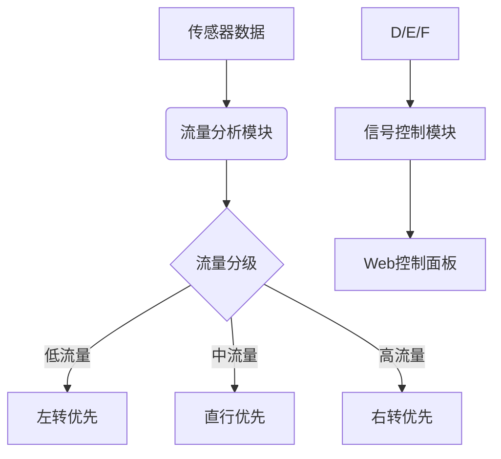

# 智能交通信号控制系统


[English](#introduction) | 中文

## 项目简介
本系统通过实时车流量分析智能调整交通信号灯配时方案，包含以下核心功能：
- 多方向车流量实时监测
- 自适应信号灯时长算法
- Web可视化控制面板
- RESTful API接口

## 技术栈
- **后端**: Python 3.8+, Flask 2.0
- **前端**: HTML5/CSS3/JavaScript
- **算法**: 基于流量分级的动态配时策略

## 安装步骤
```bash
# 克隆仓库
git clone https://github.com/yourusername/traffic-control-system.git

# 安装依赖
pip install -r requirements.txt

# 启动服务
python traffic_management.py
```

## API文档
### 车流量分析接口
```python
# interface.py

def calculate_traffic_flow(sensor_data):
    """
    根据传感器数据计算车流量
    参数:
        sensor_data (dict): 包含'flow'键的字典
    返回:
        str: 建议的信号灯类型
    """
```

### 信号控制接口
```python
# traffic_management.py

@app.route('/api/update_flow', methods=['POST'])
def handle_flow():
    """
    处理实时车流量数据并返回控制建议
    请求格式:
        {
            "flow": int  # 当前车流量
        }
    响应格式:
        {
            "status": str,
            "recommended_type": str,
            "current_flow": int
        }
    """
```

## 系统架构


---

# Intelligent Traffic Signal Control System

## Introduction
An adaptive traffic light control system with real-time monitoring and web interface.

## Features
- Real-time traffic flow analysis
- Adaptive timing algorithm
- Web-based control panel
- RESTful APIs

## Installation
```bash
git clone https://github.com/yourusername/traffic-control-system.git
pip install -r requirements.txt
python traffic_management.py
```

## Contribution
欢迎提交PR或issue，详细指南请参考[CONTRIBUTING.md](CONTRIBUTING.md)

## License
[MIT License](LICENSE)